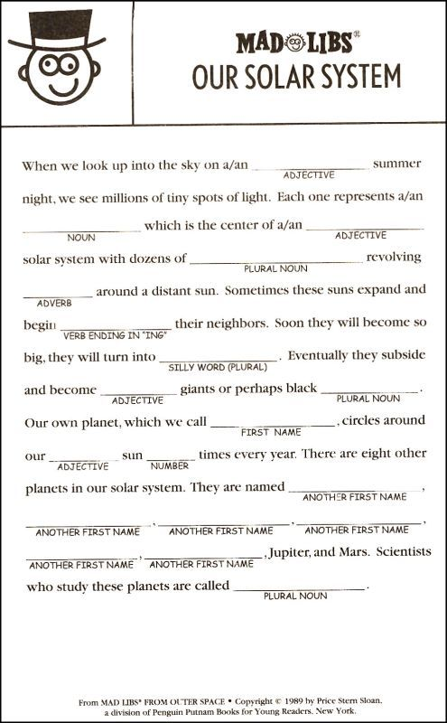

# MADLIBS PROJECT

Let's start putting our objects to good use. In this project, we're going to start using object-oriented principles to build a simple word game.  I'll build a collection of objects that work together to solve a problem. I'll also start to make use of memory management tools, as most of my objects will live on the heap. 

Before the Internet and smart-phones, entertainment was much simpler. Trying to be entertained in the back of the family car, on a family vacation to Grandma's house was essential. During those simpler times, Madlibs was a popular game.  Madlibs is a word game with multiple players. One player reads a story (to themselves), in which words have been intentionally left out. As they encounter the missing word, they ask the other players for subtitute words of a given type: "a noun", or "a color", or "a verb".  The other players offer random silly words, and the story gets filled in. At the end, the story is ready aloud with the suggested words, and it can be pretty fun. 



## Overview 

Take a look at the source files in project folder:

```
MadLibsController.hpp/.cpp		
MadlibWordProvider.hpp		
MadlibAutoWordProvider.hpp/.cpp
MadlibUserWordProvider.hpp/.cpp	
main.cpp
```

The `MadLibsController` class is used to control the process that occurs when you run the app. You can see this at work in the `main.cpp` file, in two testing methods: `testUserMadLibs` and `testAutoMadLibs`. In these methods, a collection of objects are constructed and connected, so that they can perform the task(s) specified in this project. 

The `MadlibsController` class directs the objects to do the following:

1. `readFile(const char *aFilename)` - Read the madlibs template file
2. `runStory(const char *aFilename, MadlibWordProvider &aProvider, std::ostream &anOutput)` - Iterate all the words, and find CAPITALIZED words
3. `getSubstitutes(MadlibWordProvider &aProvider)` - Ask a `MadlibsWordProvider` object to provide a substitute word of a given type for each of the CAPITALIZED words
4. `showFinishedStory(std::ostream &anOutput)` - Print the resulting story (with substitute words) on the given output stream so we can see it.
5. `std::vector<std::string> getWords();` - This function should return the protected member `words`. Note: the data type returned by this function (and the type of `words`) is `std::vector<std::string>`. The `std::vector` is provided by the `#include<vector>` and is part of something called the C++ Standard Template Library (STL). For now, you can think of this vector as a class that provides you with a much easier to use array. The type of the array elements is provided within the `<` and `>` -- so this function returns an array of strings!

The `MadlibWordProvider.hpp` is the base class for the process of choosing word-substitutions in the madlib. Each substitute word will have a type (e.g. _noun_, _verb_, _adjective_, _color_, _and so forth_...). If the madlib file requires a "NOUN", it asks a `MadlibWordProvider` (or a subclass) to suggest the word.  
The `MadlibUserWordProvider` class will simply pass that request on to the user - gathering user input on the command line whereas The `MadlibAutoWordProvider` class is an automatic word generator that makes word suggestions on its own -- without human intervention. 

## Encapsulation 

By encapsulating our classes, we gain the ability to think about what they do and how they work, without worrying that users of our class can unintentionally depend on our implementation details. All of the classes encapsulate their member data. Only an instance of each class can directly access it's members. Each class offers a very small interface (set of public methods) to control the object. 

## Inheritance 

We use `inheritance` in this solution to provide multiple types of `MadlibsWordProvider` sub-classes. The first sub-class, `MadlibsUserWordProvider` will ask the user for a word of a given type.  In contrast, the `MadlibsController` class will store each of the words provided by the user, and later substitute those words into the madlib template for everyone to read and enjoy.  

The second sub-class of `MadlibsWordProvider` is the `MadlibsAutoWordProvider` class. Instead of asking the user for a word, objects of this class will automatically choose a word of the given type at random(Like a chatbot). 

## Polymorphism

Polymorphism is used in this project when different types of `MadlibsWordProvider` objects are asked for a substitute word. The `MadlibsUserWordProvider` will respond much differently (by asking a user) than will the `MadlibsAutoWordProvider` (which automatically makes a suggestion). In either case, the `MadlibsController` will call the method, `getSubstituteWord(WordType)`, and the given word-provider object will figure out how to respond.

## Part 1 -- `MadlibsController`

The main logic for the code lives in the `MadlibsController` method, `runStory()`.  Here the `MadLibsController` object begins by reading template file, and scans the text looking for CAPITALIZED words. For each CAPITALIZED word it finds, it will send the message, `getSubstituteWord` to an appropriate `MadlibWordProvider` object. That object will get a substitute word, and return it to the `MadLibscontroller` object.  After all the words in the madlibs1.txt file have been processed, the `MadLibsController` object will then send itself the message, `showFinishedStory()` to reveal the resulting madlib.  

### Reading the madlibs file

The process will begin when the `controller` object reads the given madlibs template file. You should look at the madlibs1.txt file to see how it is formatted. You'll notice that some words are CAPITALIZED.  These words need to be substituted to complete the game.  

### GetSubstitutes

Each CAPTITALIZED word in the madlibs file represents the type of word (e.g. NOUN, VERB, etc.)   In the `MadLibsController::getSubstitutes` method, the controller will call a `MadlibWordProvider` object (i.e. `MadlibUserWordProvider` or `MadlibAutoWordProvider`) to request a word of a given type (noun, verb, etc.).  The `MadLibsController` will continue to get word substitutions from the `MadlibWordProvider` objects until all the CAPITALIZED words have been seen.  

### Showing the finished story

When the `MadLibsController` is done requesting word substitutions, it will automatically print the story to the terminal when it is ready. It does so by calling the method, `showFinishedStory(std::ostream &anOutput)`. 

## Part 2 - Build the `WordProvider` classes

`MadlibAutoWordProvider/MadlibUserWordProvider` are simple objects. They offer one main method, `getSubstituteWord(WordType)`, which accepts a word-type, and returns a word of that type back to the caller. Each of the `WordProvider` classes does this job a little differently. 

### 2a -- Getting substitute words from the user

As the `MadLibsController` finds CAPTITALIZED words in the madlibs template, it will call an available `MadlibUserWordProvider` class, and send it the message, `getSubstituteWord(type)`.  The class should display a prompt to the user on the command line, asking for a word of the given type:

```
Please enter a/an noun: 
```

Wait for the user to input a string, and return the user-provided word from the method. 

### 2b -- Getting substitute words from the automatic word generator

Next I implement the class `MadlibAutoWordProvider` found in project folder. This class is also a subclass of the `MadlibWordProvider` class, also found in project. Rather than asking the user for input, the bot will select a word at random, based on the type of word being requested. The controller will ask bot for words using the `getSubstituteWord(WordType)` method. This class uses a database of words provided as a JSON file, `words.json`. 


